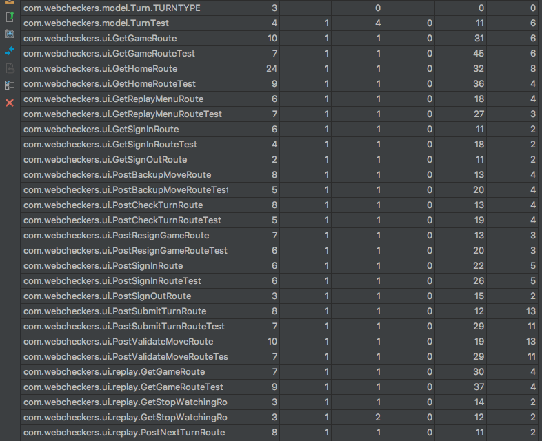

# PROJECT Design Documentation

## Team Information
* Team name: TEAM A
* Team members
  * Anthony Cianfrocco
  * Priya Jain
  * Dante Oz
  * Merry Ren

## Executive Summary

This is a summary of the project.

### Purpose
WebCheckers is an online checkers game that allows two players with accounts to play a checkers 
game against each other. The game of checkers follows the standard American rules
and players can resign their games at any time. Additionally, players can view old games (Replay Mode)
and play their checkers games Asynchronously. 

### Glossary and Acronyms

| Term | Definition |
|------|------------|
| VO | Value Object |
| MVP | Minimum Viable Product |
| UI | User Interface |
| HTML | HyperText Markup Language |
| CSS |  Cascading Style Sheets |

## Requirements

This section describes the features of the application.

### Definition of MVP
The minimum viable product is an application that allows users to sign in and play a game against an opponent. 
They can see and select their opponent from a list of online players. If the opponent they select is not in a game, 
the two players will be routed into a game. During the game, the players can perform all the basic actions of American checkers,
such as movements and kinging. At any time, a player can resign the game and will be returned to the home page. If another 
player that's online tries to start a game with one of the players already in a game, that player will not be allowed 
to start a game and will receive a message indicating a game is already in progress. When a game ends, players are 
returned to the home screen and can be selected for another game. 

### MVP Features
 **Epics and Stories in the MVP**
	
- Player Sign In
- Start a Game
- Make a Simple Movement
- Make a Single Jump Move
- Multiple Jump Move
- Valid Moves
- Kinging

### Roadmap of Enhancements
- Asynchronous Play
	- View New Move
	- View Updated Games
- Replay Mode
	- Replay Menu
	- See Last Board State
	- Exit Replay Mode
	
## Application Domain

This section describes the application domain.

In this application, Players play a game of Checkers on a Checkers board. There is a Player
and an Opponent, both of whom interact over a checkers game. The checkers game consists of
a Board and Pieces, and keeps track of turns and movement. Players can view the Board and
move Pieces. Players can resign from a checkers game as well, and can win or lose a game against
their Opponent. Players can view a Lobby of other players, and then once they pick an opponent, 
they can view the game board with their respective colors in front of them. They must concede
their turn once they've made a move, and the game board knows what pieces can move when.  

The domain model was updated at the end of Sprint 3. The functionality keeps the same interactions as above but now also represents the different domains within the actual game of WebCheckers. In the game, different actions can be taken by the players. They include BackupMove, Validate Move, Resign Game and Submit Turn. All of these domains interact with the Game, and the game pushes the changes down in the Board class. Replay Mode was also added, and consists of a parallel ReplayBoard from the Game Lobby. In Replay Mode, users can see the previous and next turns of old games, and can exit Replay Mode back into the Lobby.

## Architecture and Design

This section describes the application architecture.

### Summary

The following Tiers/Layers model shows a high-level view of the webapp's architecture.

As a web application, the user interacts with the system using a
browser.  The client-side of the UI is composed of HTML pages with
some minimal CSS for styling the page.  There is also some JavaScript
that has been provided to the team by the architect.

The server-side tiers include the UI Tier that is composed of UI Controllers and Views.
Controllers are built using the Spark framework and View are built using the FreeMarker framework.  The Application and Model tiers are built using plain-old Java objects (POJOs).

Details of the components within these tiers are supplied below.

### Overview of User Interface

This section describes the web interface flow; this is how the user views and interacts
with the WebCheckers application.

When WebCheckers launches, users are directed to a home page. Since they are not
signed in yet, they see a number of how many players are online, but not a list of
players for privacy concerns. They also see a link that says 'sign in'. When a user
clicks 'sign in' they are taken to a sign in page. Here they can enter their username.
If there is not someone with that username already signed in, that user is directed back
to the home page and have successfully logged in. If they failed to log in, the sign in 
page directed them to enter another, valid, unused username Once logged in and back on the
home page, now they can see a list of the other players who are online. To start a game,
players click on another online player's name. If that player is not already in a game, both 
players are directed to the game page, where they see a board and the checkers pieces in their 
color are laid out right in front of them. From the game players can resign and be directed back
to the home page. From the home page, they can sign out. 

The StateChart was updated to reflect the states available in the Game and to focus less on the SignIn logic and more on the Game logic. Players start from a Home page and navigate to a SignIn page where they can log in. If they are unsuccessful they must stay in the SignIn page until they either log in or make an account. Then, once signed in they go to the Home Lobby. This is the same as the home page, but has account specific information and contains a list of the online players and allows players to click on a link to enter Replay Mode. To start a game, once the user has selected a player as an opponent, they are in the start game state. From here, they can take a turn (Stable move), and then either backup or submit that move. They can also resign a game from the empty move state (before they've made/submitted a turn). The statechart doesn't clearly delineate between a move and a turn, but the application does. Once a game is over (either won/lost or resigned) the players are in the end game state. From there, they go back to the player lobby where they can start a new game, view an old game or can sign out and return to the logged out home page. If players choose to view an old game, they can see a list of their past games, click on one and begin to "replay" it. They can see the previous and next turns, and can exit from replay mode back to the home lobby.

### UI Tier

The UI Tier renders objects for the user to interact with, and communicates user actions to the Application Tier. There are two types of components in this class, The Routes and a WebServer. The Routes consist of every possible path from one page to another in WebCheckers. They also render different objects to the user depending on the situation in which they were called.

There are POST and GET Routes. GET Routes serve to render a page, and don't need to send any information from the user to the application in order to do so. POST Routes are where the user sends information to the application, and that information affects the rendering of the 'next' page. 

The WebServer keeps track of and maps all of the Routes in spark. This is what enables all of the Routes to work. 

The Application Tier Classes that the Routes interact with are GameCenter and PlayerLobby. There are too many Routes for an easy to view UML of this relationship, but an example Route UML is shown below. As can be seen, Routes have the attributes that need to be rendered to the viewer on the templateEngine, and they all override the handle method because they implement the Route interface. 

Further information for specific Route behavior can be seen in the overall sequence diagram that cuts across multiple Tiers.

### Application Tier

The Application Tier consists of the Controllers. These Controllers are known as PlayerLobby and GameCenter. Their purpose is to act as a buffer between the User (UI) and the Model Tiers. The Model Tier is the Game/Board/Objects, and the User interacts through the Routes on the WebServer. The GameCenter Controller contains the game logic. It calls all the methods needed on the Game, and renders it back to the Route. The only Model class it talks to is the Game, and all of the Routes that need the Game talk to GameCenter, and GameCenter passes to them the Game object. This is a good implementation of the Model/View/Controller design. 

GameCenter controls starting, validating, ending and gameID logic. The gameID is the essential field that associates a game with a current player, and the gameID is how that game is tracked so it can be properly updated and interacted with. GameCenter also has a lot of User Logic that it probably does not need. This logic was initially intended to be in the PlayerLobby, but trickled over into GameCenter for ease of reference and was never segmented back out again. Design wise it is still acting as a controller, so is not a terrible practice, but for readability those methods should be in the PlayerLobby, since PlayerLobby is supposed to handle user's logging in and playing each other.   

In the Start a game sequence below, PlayerLobby is used to add the newly created player to a list of usernames, and GameCenter is used to save the opponent's name once picked (getVersesList). The UML diagrams for GameCenter and PlayerLobby can be seen below.

### Model Tier

Last but not least is the Model Tier. The Model Tier does the brunt of all the game logic. The Model Tier consists of the Game, Board, Pieces, Message, Move, Piece, Player, Position, Square and Turn classes. The Game is the most notable class. In the Start a game sequence, the Game is what is returned and it is what needs to be updated when the users interact with their javascript version in the front end. The positions of the pieces are passed from the front end, through the controller, to the game, which renders the changes on the board in the back end. Once the proper logic is done, the Game object is called through GameCenter and rendered back through the GameRoute. 

The UML for the Game class is as follows:

The Game class is associated with that critical GameID, and returns the necessary information needed for GameCenter (and then by proxy the Routes). Game keeps track of whose turn is the current one. For start game it would initially be the Red Player, the player who started the game). The Game class also returns whether or not the game is over, who the Red player is, who the White player is, who the opponent is, the current Board being used, the active color (similar to the turn method). Game also has the validate, backup, submit and resign methods readily available for access through GameCenter. These methods actually occur at the Board level but are chained up for easier use.

The UML for the Board class is as follows:

The Board class knows who the players are and what color they are assigned. The Board needs to know this information as this is where the magic happens. The logic behind validate, make and backupMove all happen here. Game just talks to the Board class, the Board class pulls from the Pieces (to move them), Positions (to validate them), Squares (for the location), Turns (to return them), and Moves (to make them). The Board class contains the most logic of anything in the Model Tier, and all the back-end funnels through it. 

The rest of the Model classes were created to allow for the Board class to function. The Piece class tracks the pieces used by the players to assess whether they're valid to be taken Move. Messages are more of a UI functionality, since they're what the Routes need to send to the server. They interact with the Client side code.

In the Start a Game sequence, once startGame() is called through GameCenter, The Game class creates a Game, which creates a Board, which creates all the Squares and Pieces needed. Once a Game starts, Positions and Moves start going back and forth from the Board to the Game, and the Game is rendered to the user through the Controller.

### Sequence Diagram 

This Sequence Diagram shows how all of the Tiers interact with each other. 

A good example of how the Routes, Controllers and Models are used in WebCheckers is the start a game sequence. 

 
 GetSignInRoute and GetGameRoute are clearly critical Routes for starting a game. When the user wishes to log in, they must go to a sign in page. so from the Home page (which is initially rendered through the WebServer by GetHomeRoute), the user clicks a link which takes them to the SignIn page by way of GetSignInRoute. Once at that page, they enter a username, and if valid, are returned to the home page by way of PostSignInRoute. Now the home page is a "logged in" view (made possible by the session object attributes) and from there, the user can select an opponent from a list of also signed in users. Now this is where GetGameRoute comes into play. Once that other player's name is clicked, GetGameRoute is called. GetGameRoute knows the current player, the opponent picked, and what the current state of the game is. Since there's no game yet, GetGameRoute talks to the GameController, a controller class that serves to separate the UI from the Model. GameCenter calls startGame to create new Model entities, a new Game and a new Board for the players to use. GameCenter communicates to the Game class what the user interactions with game.ftl (rendered by GetGameRoute) are. This passed information from the user to the controller (gameCenter) allows redisplaying an updated Game to the player and the opponent.
 
A good example that runs through the whole MVP is Make a move. This covers all the move validation and turn logic that must occur. It overlaps in how the game starts, but differs in how the game is actually played. When a piece is dropped in the game, postValidateMove is called, and then the board is updated with whether or not that move is valid. If it's determined to be valid, the move can be submited, and submit turn logic decides if the move was valid again, and then sobmits the turn.

 

### Design Improvements

The Model/View/Controller dynamic is pretty solid in this project. There are a few weak points in other areas of the design though.

In the Controller design concept, The Controllers should be separated and control different aspects of the application. Right now PlayerLobby and GameCenter have redundant methods concerning adding User accounts, and other user functionality. All of those methods should be moved into the PlayerLobby class and only called through there. This condensing did not happen in Sprint 3 as the methods were called in random places and the uncoupling/rewriting did not occur due to time constraints.

Polymorphism is not used at all in the design. It is not really needed as nothing inherits, but just implements. It's possible there are areas in which the project would benefit from inheritance, but it is not immediately clear where. Everything extends from Object however, so object oriented design is strong in that respect.

The Liskov Substitution principle can be most clearly seen in the Routes, as they override the handle method from Route, and provide the same pre and post conditions. GetSignInRoute is in high adherence as it's only called when that URL is called and it returns the conditions needed to be set in response. PostResignGameRoute now returns a correct Message Type, and the javascript controller successfully redirects the route. GetHomeRoute used to not be in compliance, but the post conditions were fixed and so now it is also in high adherence.

 The Open/Closed Principle is similar to Polymorphism is that classes should be allowed to be extended, but not modified. This principle is not seen in this project as there is no inheritance, but could be added to further define what Squares whether squares are Black or White. 
 
 The Pure Fabrication principle is alive and well in this design, as it is a staple of the Controller classes. Technically, those classes could just be one class as they behave similarly. That would leave a lot of messy code and long methods however, and it's much better that both GameCenter and PlayerLobby exist to achieve high cohesion and low coupling. PlayerLobby deals with UI SignInRoutes, GameCenter deals with UI GameRoutes, and that helps keep classes from overlapping needlessly. This needs improving in the Games however, as currently the only way to get the needed game is to parse through a list of all the active games and opponent pairs in GameCenter. This means they're accessed every time GameCenter is created, and GameCenter is passed into every Route. Separating out this logic to another class would be good design practice as it's not needed every time GameCenter is. 

## Testing
This section details testing. 

### Acceptance Testing

Acceptance testing was the focus of Sprint 3. The bulk of the time was spent on refining the MVP and adding in all the needed functionality for the enhancements. All of the acceptance tests passed by the end of Sprint 3.

### Unit Testing and Code Coverage

Unit Testing has proven difficult in this project. The main issues have stemmed from needing to refactor and re think about design, as the original thoughts turned out to be incorrect. Although several Unit tests were written when the classes were originally created (as is proper), when those classes were updated the unit tests were not. Since broken Unit tests cause the project not to build, the tests were consigned to the world of comments, and never quite made it out. Code was devleloped and bugs were found right up until the deadline, and the unit tests were complex enough that they could not be written quickly.

The UI Tier always proves the hardest to test, as the server objects can be finnicky and result in null pointers. Route coverage for MVP is completed, but the added complexity of Replay Mode changed the GetGameRoute and added two new routes that were not able to be tested (as development was not completed until right up to the deadline). 

The Application Tier is not that difficult to code for, but adding methods for Replay mode changed the scope of methods which were unable to be tested.

The Model Tier went from being almost completely covered to being one of the least, as the Board and Game classes ballooned in size to accommodate Movement and Turn logic. The vast majority of classes are tested, but the aforementioned changes to how the Game and Board classes interacted with GameCenter and handled edge cases rendered most of the already written unit tests inoperable. This will be easily fixed in the next Sprint.  

Next was the Code Metric analysis. In this, several metrics were run over the final code base, and analysed in five different ways. The metrics used were Chidamber-Kemerer, Complexity, Martin Packaging, Lines of Code and JavaDoc coverage. All in all, the project was within the threshold of the metrics. 

Martin Packaging = Refers to the series of metrics that Robert C. Martin a.k.a. Uncle Bob, mentions in his book Agile Software Development: Principles, Patterns and Practices. These metrics are mostly related to class and package coupling, providing information such as Afferent and Efferent couplings between classes, abstractness, instability and distance from main sequence.

Afferent Couplings (Ca): The number of classes in other packages that depend upon classes within the package is an indicator of the package's responsibility. Afferent = incoming.

Efferent Couplings (Ce): The number of classes in other packages that the classes in the package depend upon is an indicator of the package's dependence on externalities. Efferent = outgoing.

In comparison to their functionality, our tiers' Martin Packaging metrics is pretty standard.  The model tier had the most number of afferent couplings because both the other tiers required output from the game decisions made in this tier. The number of efferent couplings was a little more surprising, as this belong to the UI tier,  suggesting that the route classes had additional outgoing dependencies from the model tier. However considering that users were playing individual games, it would also make sense that such dependencies exist.

Lines of Code = Much like classes, it provides a total count of lines of code as well as production versus test code distribution.

In order of decreasing lines of code (LOC), our packages are ordered as: UI, Model, and finally application. We expected the model to have a large number of lines because of the complexity of the game mechanics being written in this tier, and we were not mistaken with total LOC here running to be 1,989. The UI tier, however, turned out to be even more complex because of the number of routes needed to carry out page navigation signing  in, out, going to a game, playing and replaying it. With some of the routes such as GetGameRoute, GetHomeRoute, PosValidateMoveRoute, and PostSubmitTurnRoute accounting for multiple conditions, extra had to be rewritten to account for them.

Javadoc Coverage = Simple count of the number of lines of Javadoc

Our Javadoc documentation covered the majority of the methods over the UI, Application and Model tiers. What did subtract from the documentation were the test class methods, however given the time constraints of the sprints, aiming for the main folder classes was more important. We were effective at including documentation for larger classes such as Board and GameCenter. An improvement would be to also consider java documentation for the fields in our classes as well.

Complexity = Details of cyclomatic complexity, essential complexity, and extended cyclomatic dependencies of methods

Our package level did not have any issues, just method and class levels.
At the class level, where OCavg is the average cyclomatic compexity, a total of 4 classes a notably high average than the rest, and these were PostValidateMoveRoute, PostSubmitTurnRoute, GetHomeRoute, and Board. In particular, PostValidateMoveRoute and PostSubmitTurnRoute were complex of because of the number of possible different messages sent to identify the type of move made. This is something that was dictated by project requirements. Simply, we added extra cases to be more specific about the type of move, thus we believe no change is needed. The reason by GetHomeRoute's complexity is the number of possibilities entering and exiting that particular route. You can enter GetHomeRoute, signed in, after ending a game, after viewing a past game, when not being able to start a game with a selected opponent, or signed out, etc. A recommendation would be to factor out repetitive portions of the code such as setting up a view_model in separate methods however, it may also not reduce complexity by a large margin. Finally the board class being in this category is simply because it is a very large class; it is in charge of the flow of an entire game through moves and the board itself. To reduce complexity, it may be a good idea to break the Board class into subclasses so that each is not in charge of so many functions. Unsuprisingly, the board and similarily, ReplayBoard classes also have the highest weight cyclomatic complexity, however breaking these classes down as before would improve code quality.

At the method level, we see that the 3 most complex methods originate from the Board class's validate methods and the last came from PostSubmitTurn. This is understandable because move validation can result in total of 10 different types of moves. An instance of the Board class steps though a series of checks (private processing methods) to determine the correct type of move and then apply the moves to the actual board model during validation. Meanwhile, PostSubmitTurnRoute's handle method returns messages based on those 10 different types. The checks and switch cases would result in a very high complexity. Precisely because Board's validate logic is so complex is why we chose to break down validateMove into validateSingle, validateTake, hasTake and hasMulti. This in turn increased validateMove's design complexity. Because these depend on the game's logic, we would recommend not changing the methods unless we were to redesign our model tier and implementation of the actual board model.

Chidamber-Kemerer = Information on object coupling, inheritance depth, cohesion between methods (or thereof lack of).

Our most complex classes, in descending order, are Board, replayBoard, and GameCenter. While complexity is associated with less code stability, it also makes sense that these classes would have higher weighted method complexity and response for class values because of their jobs. Board implements the logic of validating and backing up moves, ReplayBoard decides moving forward or back turns, and GameCenter coordinates  collective games and their players. Each of these paths would involve multiple independent pathways. In the same manner, Board requires involving many of the classes in the model tier in order to validate moves, GameCenter needs PlayerLobby and Game to coordinate games, and ReplayBoard would need to use many of the same classes as board to step through turns.